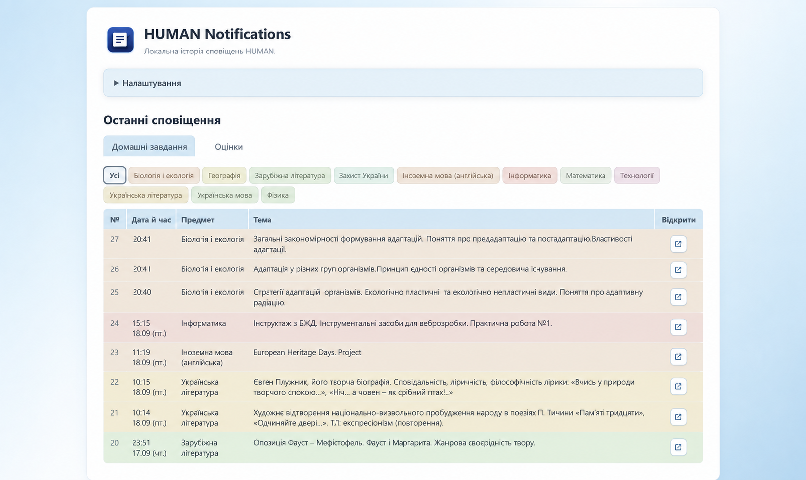

# HUMAN Notifications

Неофіційне розширення Chrome для сповіщень, домашніх завдань і оцінок із HUMAN LMS.

> Посилання на Chrome Web Store буде додано після публікації.

## Можливості

- Показує в одному місці нові сповіщення та домашні завдання з HUMAN.
- Дозволяє відкрити домашнє завдання в HUMAN прямо зі списку.
- Показує оцінки за активний навчальний рік і дає відфільтрувати їх за предметом.
- Самостійно перевіряє HUMAN із вибраним інтервалом і оновлює сеанс, якщо він закінчився.
- Показує на іконці Chrome кількість сповіщень, знайдених після останнього відкриття Dashboard.
- Дозволяє завантажити безпечний діагностичний журнал, якщо щось не працює.

## Як користуватися

1. Встановіть розширення з Chrome Web Store.
2. Відкрийте HUMAN Notifications через іконку Chrome.
3. Введіть email і пароль HUMAN та виберіть інтервал перевірки.

Badge показує сповіщення, знайдені після останнього відкриття Dashboard. Після відкриття Dashboard лічильник очищується.

## Дані та журнал

Розширення працює без реклами, аналітики й серверів розробника. Воно звертається лише до HUMAN через `api.human.ua`.

Перед введенням даних користувач підтверджує їх обробку. Повні умови: [Політика конфіденційності](PRIVACY.md).

Логін, пароль, локальна історія, оцінки та журнал зберігаються у профілі Chrome. Пароль потрібен для автоматичного повторного входу; він не показується в Dashboard і не потрапляє до завантаженого журналу.

Якщо щось не працює, відкрийте «Журнал» і натисніть «Завантажити журнал». Надішліть отриманий JSON через GitHub Issue. У ньому немає пароля, email, файлів cookie, токенів, текстів домашніх завдань чи оцінок.

«Очистити все» видаляє локальну історію, оцінки й журнал, але зберігає логін і пароль для автоматичного входу.

## Обмеження

- Це незалежний проєкт, не пов’язаний із HUMAN LMS і не схвалений HUMAN.
- Badge не є офіційним статусом непрочитаних повідомлень HUMAN.
- Для автоматичного входу пароль зберігається локально у профілі Chrome.

## Ліцензія

[0BSD](LICENSE)
